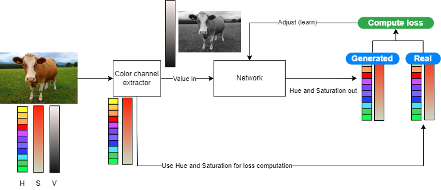
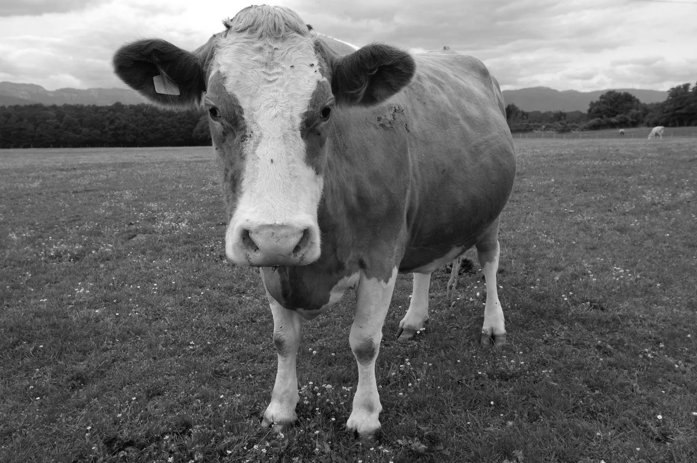

<!--<h3><b>Colorful Image Colorization</b></h3>-->
# TDT05 Mini Project: Image Colorization
## Subject
The task deals with coloring in black and white images. The idea is to have self supervised machine learning models that can learn accurate values of color for black and white images, and predict the missing colors when provided images without color.

Both a self-chosen architecture and other accomplished architectures from the field have been studied. The self-defined architecture is heavily inspired by the forked repo which is related to the code of a [paper](https://arxiv.org/pdf/1603.08511.pdf) on the subject of image coloring from 2016 by Richard Zhang, Phillip Isola, and Alexei A. Efros. Code for the self-defined architecture is present in this repository.

## Use of self-supervied learning
For this task, self-supevised learning is performed by taking input images, splitting the images into three channels; Hue, Value, and saturation, and using the Value as input while Hue and Saturation are the targets for the model. This provides the model with a black and white version of the image through only receiving the value, and the original colors of the image as its targets. A diagram of the training is provided below.

This training is self-supervised by the way the data is its own label. For the training, there is nothing done to the data other than masking the target values by removing them from the input. There is no additional labelling performed as would be required for supervised learning, nor is the model completely without correcting factors as would be the case for unsupervised learning.
## Models
### Self-defined model
In order to get some new results and to train a model from start, an attempt was made to define a new model and train it on the CIFAR-100 dataset. CIFAR contains many tiny images of dimension 32x32. The idea was that the smaller size would permit rapid training and evaluation as part of this project. The model did not achieve the results we were expecting, however the code can be found in this repo. Additionally, we showcase some results below from our experiments.

Prediction on image that was part of the training dataset

Prediction on an image that was not part of the dataset (unseen)

### Other self-supervised models
In order to present a realistic view of what is possible for image colorization, we also present and discuss some results of other models. Note that all training methods are self-supervised, but they vary in their implementation.

## Comparison with other models and ways of learning
Image in-coloring is a special task in that the other forms of learning, being supervised and unsupervised, are not applicable. This is because:
- Supervised learning requires labelling of data. The data from the image itself already contains the required labels, that being the values of the colors of the image. Labelling this manually would simply be double work
- For unsupervised learning, it is possible for a model to learn reresentations and recognize objects. It is even possible to associate colors with these representations. However, it is not possible to teach the model to _Correctly_ appy color without some data reference. If we train the model to just apply _some_ color to the objects it finds, we will be doing object detection as opposed to coloring.

With the above being said, we can make comparisons between our model, older models, and the state of the art. Although all perform self-supervised learning, they do it slightly differently.

### Colorful Image Colorization

Colorful Image Colorization was regarded as one of the best black and white image colorization algorithms when it was released back in 2016. As mentioned in the subject introduction, this is what our project was heavily inspired by. Similarly to our algorithm, the training data is practically free, because any color photo can be used as a training example by separating its channels into input and superivsory signal.

The ECCV 16, which was released along with the research paper, creates relatively good colorized images, and according to them their methods successfully fooled humans on 32 % of the trials which beated any previous method by a significant margin, at the time of its release.

### DeOldify: Self-Supervision through proprietary NoGAN
DeOldify is one of the biggest in-coloring models in terms of use. The model is vailable for use online through [DeepAI](https://deepai.org/machine-learning-model/colorizer), and as part of the image restoration offered by [MyHeritage](https://www.myheritage.no/incolor).

DeOldify is referred to by its author as being trained on "NoGAN". In traditional GAN, a generator and discriminator will be trained to either generate fake images (generator) or distinguish between real and fake images (discriminator). A key component to the NoGAN approach is that the generator is first trained in a self-supervised way only on the feature loss between its generations and expected outcomes. Only afterwards is traditional GAN training done. 

With regards to the GAN training itself, the discriminator is trained in such a way that it is automatically supervised. This is technically an internally built supervised problem, however it is worth noting that the supervision does not require human labelling. The labelling happens by the arcitechture itself, and while this does not qualify the learning as _self-supervised_ it still differs from traditional classes of supervised problems where humans normally create the labels.

Original|Colored
:------:|:-----:
|

The model does a good job of coloring in the images, with little bleeding between image components. The colored image is somewhat desaturated compared to the original. Generated image was aquired through the use of this [Google Collab](https://colab.research.google.com/github/jantic/DeOldify/blob/master/ImageColorizerColab.ipynb) found in the [DeOldify GitHub repository](https://github.com/jantic/DeOldify)
